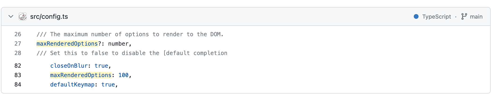

# 表达式 hints 弹窗导致的卡顿问题分析

## 当前流程
目前会在使用`ExpressionEditor`组件的地方传入计算过的 defs(stateManager.store)，并将 defs 通过 tern 的 api `addDefs`在首次加载的时候全部添加。      
之后会 installerTern 这个函数中通过传入的 codemirror 实例对 `onchange` 事件进行监听，当 expression 输入框内容变化时，会调用`t.complete(cm)` 来展示提示下拉菜单           


## 卡顿原因分析
为了避免 Editor 其它部分的影响，这里直接将一个包含了 5000+ 组件的 defs 作为静态数据从 json 导入添加(packages/editor-sdk/src/constants/ex-defs.json)     


从图二可以看到，当输入i和删除i时，由于提示弹窗内容多少的原因(输入i只展示i开头的几个组件，删除时则需要展示所有的组件)，任务的耗时会有巨大的差别，输入b由于有数千个button，也是会卡顿。          
提示弹窗部分执行的流程为，当在ExpressionEditor 中 执行 t.complete 时，`node_modules/codemirror/addon/tern.js` 会计算当前需要提示的 hint 内容(completion)，然后调用 codemirror 实例的方法 `cm.showHint` 进行展示，之后`node_modules/codemirror/addon/hint/show-hint.js`会拿到提示内容进行展示，主要的耗时代码就在这一部分：
```js
// show-hint.js
  function Widget(completion, data) {
    // ...
    console.time('耗时任务1');
    var box = completion.options.moveOnOverlap ? hints.getBoundingClientRect() : new DOMRect();
    console.timeEnd('耗时任务1');
    console.time('耗时任务2');
    var scrolls = completion.options.paddingForScrollbar ? hints.scrollHeight > hints.clientHeight + 1 : false;
    console.timeEnd('耗时任务2');
    // ...
  }
```
这个 Widget 就是 hints 弹窗提示组件。     
在没有设置 moveOnOverlap 的情况下，会调用hints.getBoundingClientRect()来获取弹窗位置，会造成弹窗重排，因此当弹窗的内容非常多的时候，就会耗时多从而造成卡顿


# 解决方案

## 防抖
目前看起来在外部添加防抖应该是行不通的，有两个原因：   
1. 在弹窗出现后，后续弹窗位置的更新是内部触发的(监听cursorActivity)，在有提示弹窗的情况下继续输入依然会卡顿
2. 第一次出现弹窗的时候依然卡顿

## 控制弹窗最大内容
目前看起来最理想的可能是控制 hints 的内容，因为正常不会从这么多的内容中去查找。显示的内容减少可以极大减少重排的时间，不论是第一次弹窗还是后续输入都可以比较流畅。    
控制弹窗最大内容的方式目前没有从文档中找到外部参数设置，可以实现这一目标的方式有两种：

### 重新实现 tern.js
可以参考`packages/editor-sdk/src/components/Form/ExpressionEditor/TernServer.ts`(拷贝自[appSmith](https://github.com/appsmithorg/appsmith/blob/8b329fe7adc9a68d8b727baecff256592ec3bb7d/app/client/src/utils/autocomplete/CodemirrorTernService.ts)，appsmith没有限制最大显示内容，但是没有我们那么卡顿，应该是做了其它优化，不过在内容特别多的时候依然会有一些卡顿)   
有了重写的 tern.js 就可以比较自由的控制要展示的内容了，比如可以简单给最后返回的hints内容做一个截取：
```js
const obj = {
    from: from,
    to: to,
    // hints 提示的内容
    list: completions.slice(0, 100).concat({
        text: '...',
        origin: 'customDataTre',
        type: 'OBJECT',
        data: {
            name: "...",
            origin: "customDataTree",
            type: ""
        }
    }),
    selectedHint: indexToBeSelected,
};
```
     
示例的处理比较粗糙，如果采用这种方法需要更细致的重写一下tern.js的内容，当然好处就是可以进行一些额外的定制和优化，appsmith中也是对这一部分进行了优化

### 使用 codemirror/autocomplete 库   
这个库提供了一个 `maxRenderedOptions⁠` 的选项来设置最大渲染的下拉选项，并且默认设置了 100

    
上面的预览可以在`packages/editor-sdk/preview`执行`yarn dev`来进行预览，直接引用组件是可以用的
使用这个库存在的问题是如果在 editor-sdk 进行封装，打包后会在 editor 中引用会报错：


会报多个 codemirror/state 实例被加载的错误，如果在 tsup 中通过 external 忽略这个包，或者在依赖中添加这个包，打包后不会报错，但是无法正常工作
   

初步猜测应该是打包的问题


# 其它
不论采取那种办法，应该都还有很多工作需要完成，目前编辑器相对于其它低代码还不够好用,比如样式还不够美观，编辑器弹窗光标有时还不准确，`{{}}`没有自动完成功能等等    
以及 yangfeng 提到的想要在 transformer 变量中显示其内容，这些应该都可以通过 codemirror 提供的 Api 和插件来实现，但都需要时间来研究    
selectHint 是用来控制第几个选中的，会给加上类名并高亮